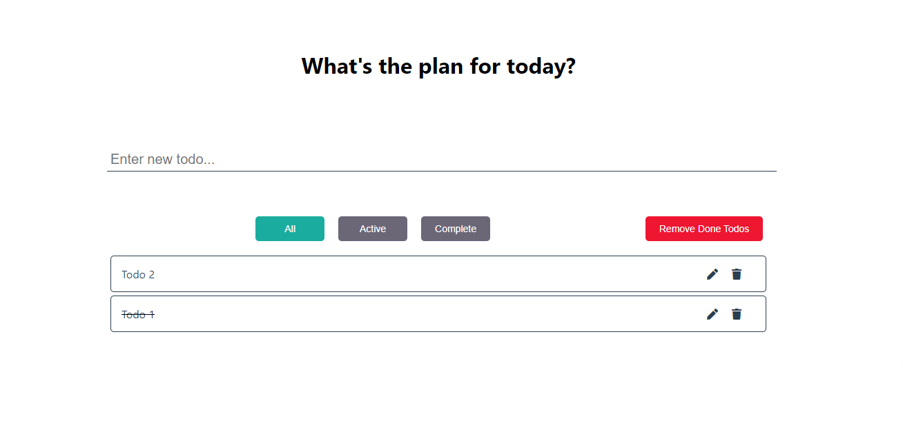
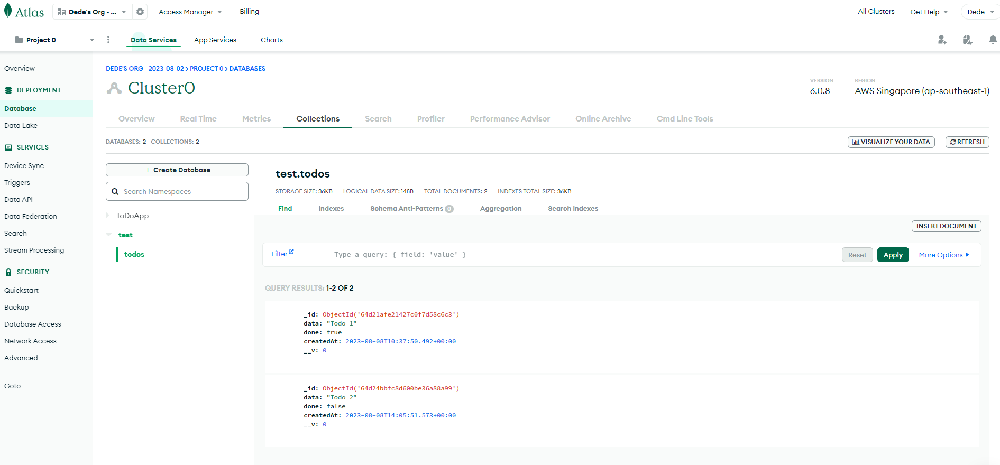

# MERN Todo-List

This is a hands-on project Todo List fullstack
  
# Demo

Frontend App

<div align="center">
  
</div>

Mongo DB

<div align="center">
  
</div>


# Features

- A MERN (MongoDB + Express.js + React.js + Node.js) full stack project.
- Refactored with ES6 and ES7 syntax (eg: async/await)
- RESTful API:

```
-------------------------------------------------------------------------
Todos Route
-------------------------------------------------------------------------
[Method]  [Route]
GET       /api/todos              Fetch all todos
POST      /api/todos              Create a new todo
GET       /api/todos/:id          Fetch a todo status
POST      /api/todos/:id          Toggle (complete or not) a task
PATCH     /api/todos/:id          Update the todo content
DELETE    /api/todos/:id          Delete todo
```

# Technologies

## Frontend

- [React](https://reactjs.org/)
- [Redux](https://redux.js.org/)

## Backend

- [nodejs](https://nodejs.org/en/)
- [express](https://gulpjs.com/)
- [mongodb](https://webpack.js.org/concepts/)


# Getting Started

Follow the instructions below to set up the environment and run this project on your local machine. Note that you should setup your MongoDB Atlas Cluster first to get your database.

1. Clone this repository.

```bash
# Clone repository
$ git clone https://github.com/DedeBrahma/MERN_ToDo.git
```

2. Install dependencies via NPM or Yarn

```bash
# Install backend dependencies via npm
$ cd server
$ npm install
$ npm start

# Install frontend dependencies via npm
$ cd client
$ npm install
$ npm start
```
